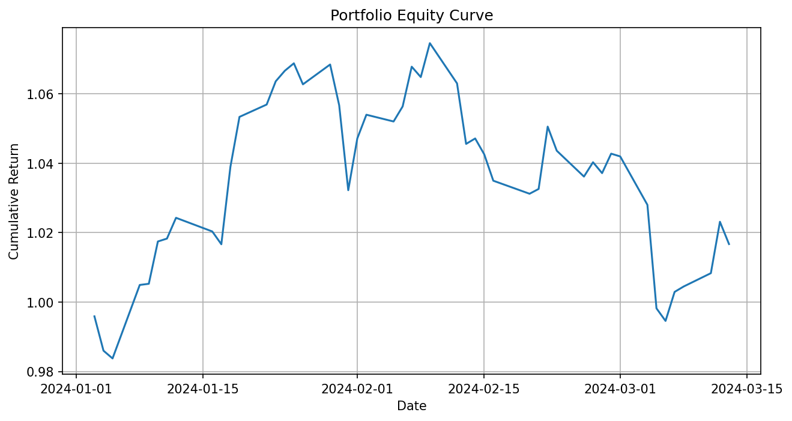

# Portfolio Risk Dashboard

A Python-based portfolio risk analytics tool for evaluating historical performance, downside risk, drawdown, and asset correlation of a multi-asset portfolio.

## Motivation

Portfolio construction is not only about expected return. A professional investment workflow should also consider volatility, downside risk, tail loss, maximum drawdown, and asset correlation.

This project implements a lightweight risk dashboard to analyze these dimensions using historical market data.

## Features

- Historical price data download
- Daily return calculation
- Portfolio return aggregation
- Annualized return
- Annualized volatility
- Sharpe ratio
- Historical Value at Risk
- Conditional Value at Risk
- Maximum drawdown
- Equity curve visualization
- Drawdown visualization
- Correlation matrix visualization

## Methodology

The portfolio return is calculated as:

```math
r_p = \sum_i w_i r_i

### where ( w_i ) is the portfolio weight of asset ( i ), and ( r_i ) is its daily return.
Historical VaR is estimated from the empirical distribution of portfolio returns. CVaR is calculated as the average loss beyond the VaR threshold.
### Example
tickers = ["AAPL", "MSFT", "NVDA", "JPM"]
weights = [0.25, 0.25, 0.25, 0.25]

## Example Outputs

### Equity Curve



### Drawdown


### Correlation Matrix


