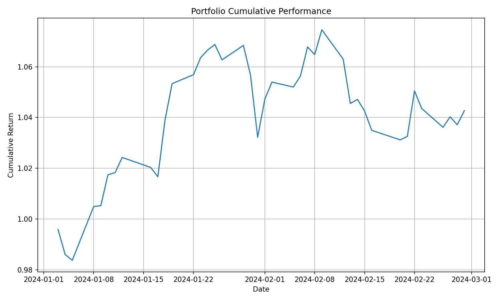
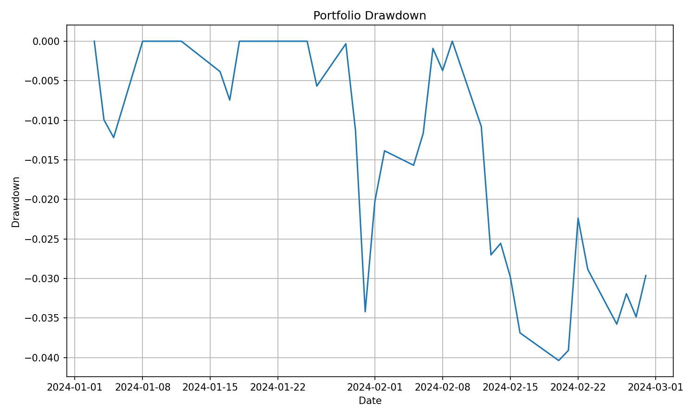
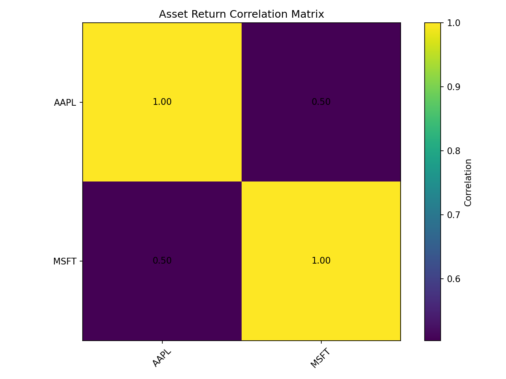
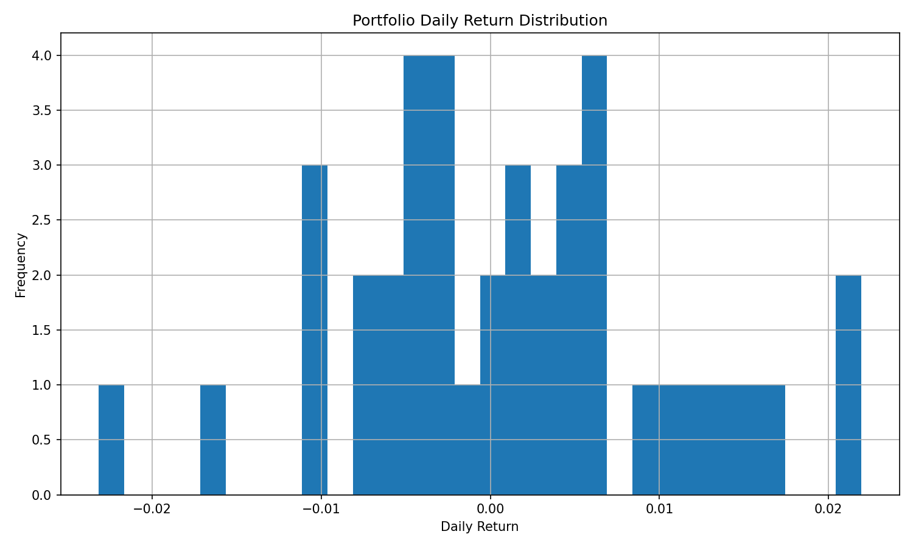

# Portfolio Risk Dashboard

A lightweight Python-based portfolio risk analytics dashboard that loads historical market data, calculates portfolio risk metrics, and visualises portfolio performance and downside risk.

This project demonstrates Python, financial data processing, portfolio risk analysis, risk metric calculation, and a reproducible data pipeline with local CSV fallback support.

## Project Overview

The dashboard evaluates a simple multi-asset equity portfolio and reports key risk and return indicators.

Current features include:

- Historical price data loading
- Automatic fallback to local sample data if online data download fails
- Daily return calculation
- Portfolio cumulative return calculation
- Annualised return
- Annualised volatility
- Sharpe ratio
- Maximum drawdown
- Historical Value at Risk
- Historical Conditional Value at Risk
- Portfolio performance chart
- Drawdown chart
- Asset correlation matrix
- Return distribution histogram

The project is intentionally modular so that it can be extended later with portfolio optimisation, factor analysis, stress testing, benchmark comparison, and interactive dashboarding.

## Why This Project

Financial data pipelines often fail when relying only on live API access. This project therefore uses a more robust structure:

1. First, the program attempts to download market data using `yfinance`.
2. If the download fails, the program automatically falls back to a local CSV file.
3. This ensures that `python3 main.py` can still run successfully even when the online data source is unavailable.

This makes the project more reliable for GitHub review, portfolio demonstration, and local testing.

## Project Structure

```text
portfolio-risk-dashboard/
│
├── main.py
├── requirements.txt
├── README.md
│
├── src/
│   ├── __init__.py
│   ├── data_loader.py
│   ├── risk_metrics.py
│   └── visualization.py
│
├── data/
│   └── sample_prices.csv
│
└── outputs/
    ├── portfolio_performance.png
    ├── drawdown.png
    ├── correlation_matrix.png
    └── return_distribution.png
```

## Technologies Used

- Python 3
- pandas
- numpy
- matplotlib
- yfinance

## Installation

Clone the repository:

```bash
git clone https://github.com/luka77bie/portfolio-risk-dashboard.git
cd portfolio-risk-dashboard
```

Install dependencies:

```bash
pip3 install -r requirements.txt
```

If you are using a virtual environment:

```bash
python3 -m venv venv
source venv/bin/activate
pip install -r requirements.txt
```

## How to Run

Run the main script:

```bash
python3 main.py
```

If the program runs successfully, it will print a portfolio risk summary in the terminal and generate output charts inside the `outputs/` folder.

Example output:

```text
Portfolio Risk Summary
----------------------
Assets: AAPL, MSFT
Start Date: ...
End Date: ...
Number of Observations: ...
----------------------
Annualised Return: ...
Annualised Volatility: ...
Sharpe Ratio: ...
Maximum Drawdown: ...
95% Historical VaR: ...
95% Historical CVaR: ...

Charts saved to outputs/:
- outputs/portfolio_performance.png
- outputs/drawdown.png
- outputs/correlation_matrix.png
- outputs/return_distribution.png
```

## Example Outputs

### Portfolio Performance



### Drawdown



### Correlation Matrix



### Return Distribution



## Data Pipeline

The data loading logic is handled in:

```text
src/data_loader.py
```

The system follows this logic:

```text
Try to download historical prices from yfinance
        ↓
If successful, use downloaded market data
        ↓
If unsuccessful, load data/sample_prices.csv
        ↓
Calculate returns and portfolio risk metrics
        ↓
Generate portfolio risk visualisations
```

This fallback design makes the project more stable than a script that depends only on live API access.

## Risk Metrics

### Annualised Return

Annualised return estimates the portfolio's yearly return based on average daily returns.

### Annualised Volatility

Annualised volatility measures the standard deviation of portfolio returns on a yearly basis.

### Sharpe Ratio

The Sharpe ratio measures return per unit of risk.

In this project, the basic Sharpe ratio is calculated without a risk-free rate assumption.

### Maximum Drawdown

Maximum drawdown measures the largest peak-to-trough decline in portfolio value.

It is useful for understanding downside risk.

### Historical Value at Risk

Historical VaR estimates a downside return threshold based on the empirical distribution of historical portfolio returns.

In this project, VaR is reported as a return quantile. A negative VaR value represents a loss.

### Historical Conditional Value at Risk

Historical CVaR estimates the average portfolio return conditional on returns being worse than the VaR threshold.

It is useful for understanding tail risk beyond the VaR cutoff.

## Example Portfolio

The default example portfolio uses:

```text
AAPL
MSFT
```

The portfolio weights are set inside `main.py`.

These tickers and weights can be modified to test different portfolios.

## Local Sample Data

The project includes a local fallback dataset:

```text
data/sample_prices.csv
```

This file allows the project to run even if `yfinance` cannot download data due to network issues, API rate limits, or temporary service problems.

## Future Improvements

Possible extensions include:

- Add more assets and dynamic portfolio weights
- Add rolling volatility
- Add rolling VaR
- Add benchmark comparison
- Add mean-variance portfolio optimisation
- Add efficient frontier visualisation
- Add minimum volatility portfolio
- Add maximum Sharpe portfolio
- Add Streamlit dashboard interface
- Add unit tests
- Add GitHub Actions workflow for automated testing

## Limitations

This project is for educational and portfolio demonstration purposes only.

It is not financial advice and should not be used as a production trading or investment system.

The risk metrics are simplified and do not account for transaction costs, taxes, liquidity constraints, market impact, rebalancing rules, or changing risk-free rates.

Historical VaR and CVaR are based on past return distributions and should not be interpreted as guarantees of future downside risk.

## Author

Jiacheng Bie

## License

This project is open for educational use.